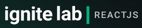
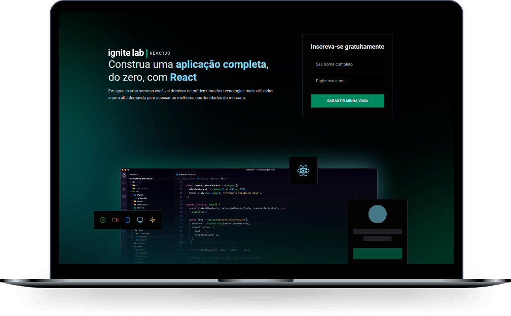
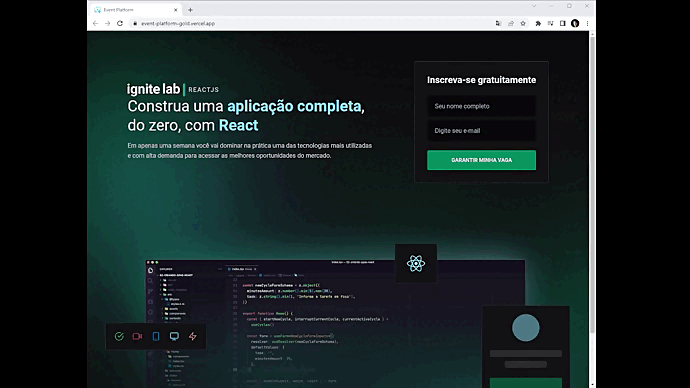

<!---------- Title/ Logo -------------->
<h1 align="center">
  
</h1>

<!-- ------- Ancoras --------------->
<p align="center">
  <a href="#-sobre">Sobre</a>&nbsp;&nbsp;&nbsp;|&nbsp;&nbsp;&nbsp;
  <a href="#-projeto">Projeto</a>&nbsp;&nbsp;&nbsp;|&nbsp;&nbsp;&nbsp;
  <a href="#-telas">Telas</a>&nbsp;&nbsp;&nbsp;|&nbsp;&nbsp;&nbsp;
  <a href="#-tecnologias">Tecnologias</a>&nbsp;&nbsp;&nbsp;|&nbsp;&nbsp;&nbsp;
  <a href="#-licença">Licença</a>
</p>

<!---------- Badges ----------------->  
<p align="center">
   
  
  
  
  <!----(4953b8)--BlueDark -->
  <!----(49AA26)--Green -->
  <!----(008ed6)--Blue -->
  <!----(3292a6)--BlueMedium-->
  <!----(015F43)--GreenMedium-->
</p>
<br>
<!---------- showcase  ----------------->  
<p align="center">
  
</p>

 <!----- Acess Deploy Demonstration-->
 <h5 align="center">
    🎬 Clique Aqui: &nbsp; <a href="https://event-platform-gold.vercel.app/">  Visualizar Demonstração </a> 
 </h5>


<!----- Description ------------------>
## 🔖 Sobre

 &nbsp;&nbsp;&nbsp;&nbsp;Este projeto é parte do evento que participei o **Ignite Lab**  da [Rocketseat](https://rocketseat.com.br). &nbsp;&nbsp;Foi uma semana de maratona de estudos sobre desenvolvimento React, em sua 2° edição. 
 
 &nbsp;&nbsp;&nbsp;&nbsp;O projeto denominado **Event-Platform**, teve como objetivo criar um aplicação Web de plataforma de eventos com cronograma de aulas liberadas por periodo de datas de apresentar vídeos aulas praticas ou live. 
 &nbsp;&nbsp;O sistema **Event-Platform**, é uma aplicação que permite pessoas acessarem através de login nome, e-mail pessoal, e poder assistir couteudo de professoes e licões cadastradas em  pout's de publicações, criadas e atualizadas através da plataforma de [Graphcms](https://app.graphcms.com) pelo painel admin principal fonte de cadastro de todo conteúdo da aplicação.
  
  <br>

  ## 💻 Projeto
  
 &nbsp;&nbsp;&nbsp;&nbsp;A Construção e desenvolvimento foi através de conceitos de arquitetura e plugins da linguagem **React.js** e **Vite**, utilizando dependências das bibliotecas **TypeScript**, aplicados a utilização de componentes aplicados a contextos e vantagens de poder ser consumidos em requisições clientes **API**, como foi o caso deste projeto onde criamos toda parte do (Front-End) e preparamos tada sua estrutura permitindo consumir uma **API-CSM**,através do modelo de construção em **GraphQL** . 
  
  &nbsp;&nbsp;&nbsp;&nbsp;O conceito da aplicação se resume na criação de um modelo de aplicação web tendo a criação de componentes internos e desenvolvidos em React.js com TypeScript, utilizado um modelo de manipulação Dados por Schemas obtendo "Query/Mutations", através da estrutura de GraphQl como **Back-End**, e como end-point consumindo a API-CSM construída na plataforma [Graphcms](https://app.graphcms.com), e utilizado a Lib: [Appolo-Graphql](https://www.apollographql.com/), para o cliente API, por sua melhor eficiência no controle de cache para este modelo.
  &nbsp;&nbsp; A contrução do modelos de style **CSS** utilizado as dependências do [Tailwind](https://tailwindcss.com/), com o objetivo de melhorar sua produtividade de construção e como biblioteca de icons: [Phosphor-react](https://phosphoricons.com/) super completa e super flexível recomendável para React.  
  &nbsp;&nbsp;&nbsp;&nbsp; A aplicação do componente de vídeo, utilizado biblioteca [Vime](https://vimejs.com/getting-started/installation#react), que contem recursos prontos para maior parte de conteúdo on-line disponíveis das principais plataforma de canais de vídeos, e para este projeto utilizamos o modelo que utilizamos no projeto que foi Youtube.

<br>

 ###### **Evento :** Maratona -Ignite Lab 2ª Edição - [Rocketseat](https://rocketseat.com.br)
 ###### **Instrutor :** Diego Fernandes
<br>

<!----- Showcase Screens Shot------------------>
## 💻 **Telas**

<div align="center">



</div>
<br>
<br>

<!----- Pré Requisitos ---------------------------->

## 🚀 Tecnologias

- [HTML5](https://pt.wikipedia.org/wiki/HTML5) - Hyper Text Markup Language - linguagem de marcação de hipertexto.
- [React](https://reactjs.org/) -Biblioteca JavaScript para criação de Interfaces (Front-End).
- [Vitejs](https://vitejs.dev/) - Ferramenta contrução Front-end da prox. geração.
- [Tailwind](https://tailwindcss.com/) - Estrutura de Modelo CSS-Cascading Style Sheets - estilização de código html.
- [GraphCMS](https://graphcms.com/) - Sistema gerenciamento de conteúdo (APIs-CMS).
- [GraphQL](https://graphql.org/) - Modelo Query linquagem para APIS runtime.
- [Apollo](https://www.apollographql.com/) - Biblioteca de gerenciamento JS para GraphQL.
- [TypeScript](https://www.typescriptlang.org/) - Conjunto da linguagem JavaScript com definições de tipo estático.
- [Node.js](https://nodejs.org/en/) - Ambiente de execução Javascript server-side.
- [VS Code](https://code.visualstudio.com/) - Editor de desenvolvimento de aplicações web.
- [Vime](https://vimejs.com/) - Media player personalizável, extensível, acessível e agnóstico de estrutura.
- [Phosphor-react](https://phosphoricons.com/) - Biblioteca Icons flexiveis para interfaces.
- [Vercel](https://vercel.com/) - Plataforma voltada para a hospedagem de aplicações.

<br>

## 📝 Licença
<a href="https://opensource.org/licenses/MIT">
    
</a>

 &nbsp;&nbsp;&nbsp;&nbsp;Esse projeto está sob a licença MIT. Veja o arquivo [LICENSE](https://opensource.org/licenses/MIT) para mais detalhes.

 <br>

<!----- Configurations ---------------------------->
 ## 📌 Instruções : 

Para iniciar o Servidor da aplicação use o comando: **_npm run dev_** então acesse pelo navegador **_http://localhost:3000/_** 

<br>

## 📁 Como Baixar o Projeto

```bash
  # Clonar o repósitorio
  $ git clone https://github.com/alxlima/Event-Platform.git

  # Entrar no diretório
  $ cd c:/nlw/ignitelab/event-platform

  # Instalar as dependências
  $ npm install
  
  # Iniciar o Projeto
  $ npm run dev

  # Acess localhost
  $ http://localhost:3000/
```
#
 Desenvolvido 🚀 por: ***_Alex Sandro da Silva lima_***


[](https://www.linkedin.com/in/alex-sandro-da-silva-lima-8b297839/) 
[](mailto:alex_lima2013@hotmail.com)

